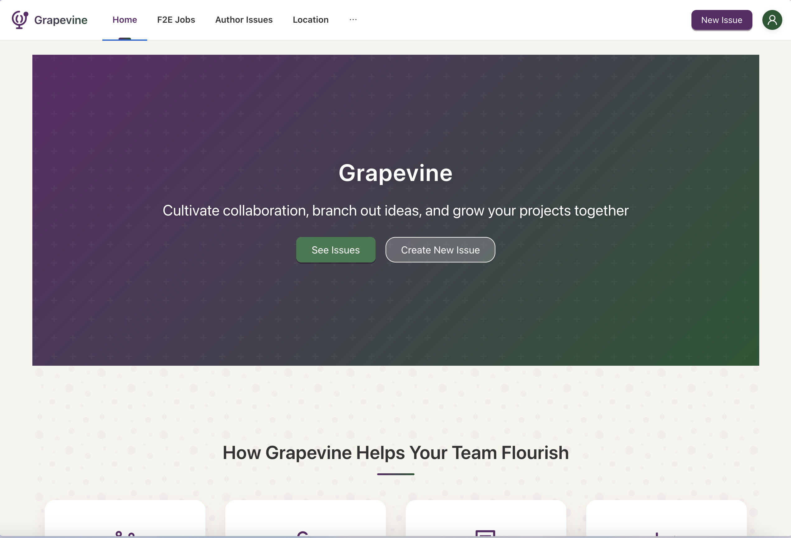

# Grapevine

Grapevine is a modern forum application that integrates with GitHub issues to create a clean, collaborative discussion platform with analytics capabilities.



[DEMO](grapevine-six-gr925.vercel.app/)

## Features

- **GitHub Integration**: Connect to GitHub repositories for content management
- **Multiple Repository Support**: Manage content from various GitHub repositories
- **Repository Management**: Add, remove, and track repositories
- **Interactive Comments**: Integrated comment system with Utterances
- **Dual Content Sources**: Display community discussions and F2E jobs
- **Analytics Dashboard**: Visualize data with interactive charts
- **Location Services**: GPS-based positioning with interactive maps
- **Reverse Geocoding**: Convert coordinates to human-readable addresses
- **Search & Filtering**: Advanced search and tag filtering functionality
- **Create New Issues**: Submit new content directly through the platform
- **Modern UI**: Clean design built with Ant Design
- **Responsive Design**: Optimized for all device sizes
- **Data Visualization**: Interactive charts using Ant Design Charts
- **Community Features**:
  - **Anonymous Rumor Wall**: Share and vote on tech industry gossip without attribution
  - **Active Commenters Leaderboard**: Showcase top community contributors
  - **Weekly Rumor Digest**: Newsletter-style compilation of trending rumors

## Quick Start

### Installation

1. Clone this repository

   ```
   git clone https://github.com/yourusername/grapevine.git
   cd grapevine
   ```

2. Install dependencies

   ```
   npm install
   ```

3. Set up environment variables

   Create a `.env` file with:

   ```
   VITE_GITHUB_TOKEN=your-github-personal-access-token
   VITE_DEFAULT_REPO_OWNER=your-default-repo-owner
   VITE_DEFAULT_REPO_NAME=your-default-repo-name
   ```

4. Start the development server

   ```
   npm run dev
   ```

5. Open your browser and visit `http://localhost:5173`

### Build for Production

```
npm run build
```

Generated files will be in the `dist` folder.

## Usage Guide

### Landing Page

The landing page provides an overview of the platform and quick access to main features.

### Repository Management

- Add and manage multiple GitHub repositories
- Track activity and statistics for each repository
- Configure display settings for different repositories

### Browse Issues and Discussions

- View issues from different repositories in a unified interface
- Filter issues by tags, status, or custom search terms
- Sort and organize content for easier navigation

### Comments

The application uses Utterances for comments, allowing GitHub-based authentication and interactions directly in the interface.

### Analytics Dashboard

Visualize repository data with interactive charts:

- Issue activity over time
- Tag distribution
- User engagement metrics
- Content performance statistics

### Location Services

Access location-based features:

- Current location detection
- Map visualization
- Address details via reverse geocoding
- Dedicated location services page

### Community Features

Engage with the community through specialized features:

- **Anonymous Rumor Wall**: Share short, anonymous tech rumors and vote on their credibility
- **Active Commenters Leaderboard**: See who's most actively contributing to discussions
- **Weekly Rumor Digest**: Browse a curated collection of the week's most popular rumors in a newsletter format

## Project Structure

```
src/
├── api/
│   ├── githubApi.ts           # GitHub API integration
│   └── repositoryApi.ts       # Repository data handling
├── assets/                    # Static assets
├── components/
│   ├── AppLayout.tsx          # Main application layout
│   ├── AntConfigProvider.tsx  # Ant Design configuration
│   ├── CategoryTabs.tsx       # Content categorization
│   ├── CommentSection.tsx     # Comments component
│   ├── F2EIssueDetail.tsx     # F2E job issue details
│   ├── F2EIssueList.tsx       # F2E jobs listing
│   ├── GeoLocation.tsx        # Location services
│   ├── HomePage.tsx           # Main landing page
│   ├── IssueDetail.tsx        # Issue details
│   ├── IssueList.tsx          # Issue listing
│   ├── LocationMap.tsx        # Map component
│   ├── NewIssue.tsx           # Create new issues
│   ├── RepositoryIssueDetail.tsx  # Repository-specific issue details
│   ├── RepositoryIssueList.tsx    # Repository-specific issue listing
│   ├── RepositoryManagementPage.tsx  # Repository management
│   ├── SearchAndFilter.tsx    # Search & filtering
│   ├── UtterancesComments.tsx # GitHub comments integration
│   ├── charts/                # Data visualization components
│   └── community/             # Community features components
│       ├── AnonymousRumors.tsx   # Anonymous rumor wall
│       ├── ActiveLeaderboard.tsx # Active commenters leaderboard
│       ├── RumorDigest.tsx       # Weekly rumor digest
│       └── CommunityFeatures.tsx # Main community component
├── pages/
│   ├── AnalyticsDashboard.tsx # Data analytics page
│   ├── CommentsExample.tsx    # Comment example page
│   ├── CommunityPage.tsx      # Community features page
│   ├── CreatedIssuesPage.tsx  # User-created issues
│   ├── GitHubIssuesPage.tsx   # GitHub issues page
│   ├── IssueSubmissionPage.tsx# Issue submission confirmation
│   ├── LandingPage.tsx        # Landing page
│   └── LocationPage.tsx       # Location services page
├── routes/
│   └── index.tsx              # Application routing
├── services/                  # Service modules
├── store/
│   ├── commentsSlice.ts       # Comments state
│   ├── f2eIssuesSlice.ts      # F2E issues state
│   ├── githubIssuesSlice.ts   # GitHub issues state
│   ├── index.ts               # Redux store configuration
│   ├── locationSlice.ts       # Location state
│   ├── repositoriesSlice.ts   # Repositories state
│   ├── searchSlice.ts         # Search state
│   └── userSlice.ts           # User state
├── styles/                    # Global styles
└── types/                     # TypeScript interfaces
```

## Technology Stack

- **Frontend Framework**: React 18
- **Language**: TypeScript
- **State Management**: Redux Toolkit
- **UI Framework**: Ant Design
- **Routing**: React Router 6
- **Data Fetching**: Octokit for GitHub API
- **Comments**: Utterances
- **Maps**: Leaflet with React-Leaflet
- **Visualization**: Ant Design Charts
- **Markdown Rendering**: React Markdown with remark-gfm
- **Code Highlighting**: React Syntax Highlighter
- **Build Tool**: Vite
- **Styling**: SCSS
- **Deployment**: Vercel

## Configuration

### GitHub Integration

The application connects to GitHub repositories for:

1. Default repository - Set via environment variables
2. User-added repositories - Managed through the repository management interface
3. F2E Jobs - Connects to f2etw/jobs repository for job listings

### Theme Customization

The Ant Design theme is configured in `src/components/AntConfigProvider.tsx`.

### Location Services

Location services use:

- Browser's Geolocation API for user coordinates
- OpenStreetMap's Nominatim API for reverse geocoding
- Leaflet for interactive maps

## License

This project is licensed under the MIT License.

## Author

Gorman
